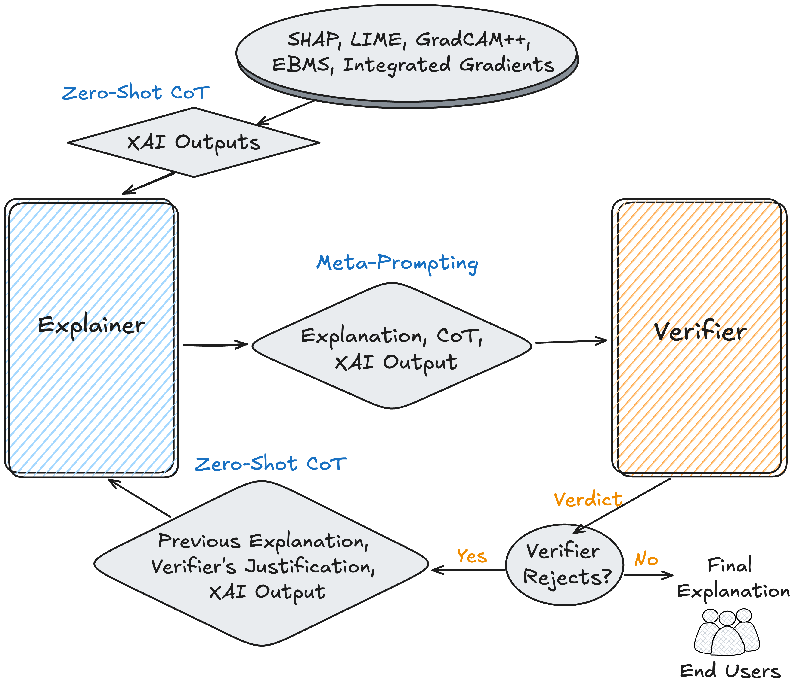

# Two-Stage LLM Framework for Accessible & Verified XAI Explanations

 [](https://ollama.com) 

This repository provides the implementation of a Two-Stage LLM Meta-Verification Framework designed to transform technical eXplainable AI (XAI) outputs into accessible, faithful, and reliable natural language explanations. By employing an independent verification-and-repair cycle, the framework systematically detects and corrects hallucinations, omissions, and reasoning failures before they reach the end user.

<div align="center">
  <picture>
    <source media="(prefers-color-scheme: dark)" srcset="Docs/Framework-Nutshell-dark.png">
    <source media="(prefers-color-scheme: light)" srcset="Docs/Framework-Nutshell-light.png">
    
  </picture>
</div>

---

## Overview

Traditional XAI methods often produce technical outputs—such as feature importance scores or spatial saliency maps—that are difficult for non-experts to interpret. While LLMs can act as mediators to generate human-readable text, they often lack guarantees of accuracy and completeness.

This framework addresses these limitations through a three-part process:
1. **Explanation**: Converting raw XAI data into natural-language explanations via an Explainer LLM.
2. **Verification**: Assessing explanations for faithfulness, coherence, completeness, and hallucination risk using a Verifier LLM.
3. **Refinement**: Utilizing an iterative refeed mechanism to guide the Explainer toward corrected outputs based on Verifier feedback.

### Key Performance Metrics
* **Reliability**: Meta-verification increases explanation accuracy from a 59–77.8% baseline to **81.8–95.21%**.
* **Error Mitigation**: For the best-performing model pair, the framework blocks **78.5%** of erroneous explanations.
* **Accessibility**: Improves Flesch Reading Ease by up to **+16.40 points** and reduces complexity by nearly **9 grade levels**.
* **Convergence**: Achieves a **96.92%** average convergence rate, typically resolving errors within 1-2 iterations.

---

## Supported XAI Methods and Datasets

The framework is method-agnostic and has been validated across diverse data modalities and explanation techniques:

| Dataset | Modality | XAI Method | Model Type |
| :--- | :--- | :--- | :--- |
| **ACS Income** | Tabular | SHAP | XGBoost Classifier |
| **Diamonds** | Tabular | LIME | XGBoost Regressor |
| **IMDB Reviews** | Text | Integrated Gradients | LSTM Sentiment Classifier |
| **Wine Quality** | Tabular | EBMs | Explainable Boosting Machine |
| **CIFAR-10** | Image | Grad-CAM++ | ResNet-20 CNN |

---

## Quick Start

### Prerequisites
* **Ollama**: Ensure [Ollama](https://ollama.com) is installed and running on the default port (**11434**).
* **Models**: Pull the required models before running (e.g., `ollama pull gpt-oss:20b`).

### Installation
```bash
# Clone the repository
git clone https://github.com/gMerm/Two-Stage-LLM-Framework-For-Verified-XAI-Explanations.git
cd Two-Stage-LLM-Two-Stage-LLM-Framework-For-Verified-XAI-Explanations

# Set up environment
python3.10 -m venv venv
source venv/bin/activate
pip install -r requirements.txt
```

### Configuration

Edit `src/architecture.yaml` to configure your preferred LLM pairs. Recommended configuration for high-precision verification:
```bash
explainer:
  model: "gpt-oss:20b"
  temperature: 0.6
  max_tokens: 2048

verifier:
  model: "qwen3:30b"
  temperature: 0.6
  max_tokens: 2048
```

### Project Structure
```bash
├── src/
│   ├── explainer/              # Stage 1: Explanation generation
│   ├── verifier/               # Stage 2: Verification
│   ├── refeed_mech/            # Stage 3: Error correction loop
│   └── architecture.yaml       # Global LLM settings
├── Use-Case-datasets/          # Processed data for ACSIncome...
├── XAI-Methods/                # Backend XAI implementations
├── XAI-Methods-outputs/        # Raw technical explanation data
└── Flesch-Kincaid/             # Readability evaluation scripts
```


## Publication and Venue

This research has been accepted for publication at the **World Congress of Computational Intelligence (WCCI) 2026**, appearing in the proceedings of the **International Joint Conference on Neural Networks (IJCNN)**.

## Funding and Acknowledgments

This research was partially supported by project MIS 5154714 of the National Recovery and Resilience Plan Greece 2.0, funded by the European Union under the NextGenerationEU Program. The authors acknowledge the Computer Centre of the Department of Computer Engineering & Informatics at the University of Patras for providing the computational resources required for this research.